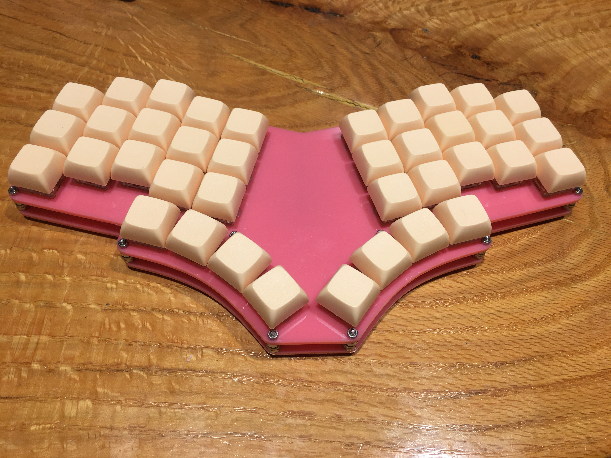
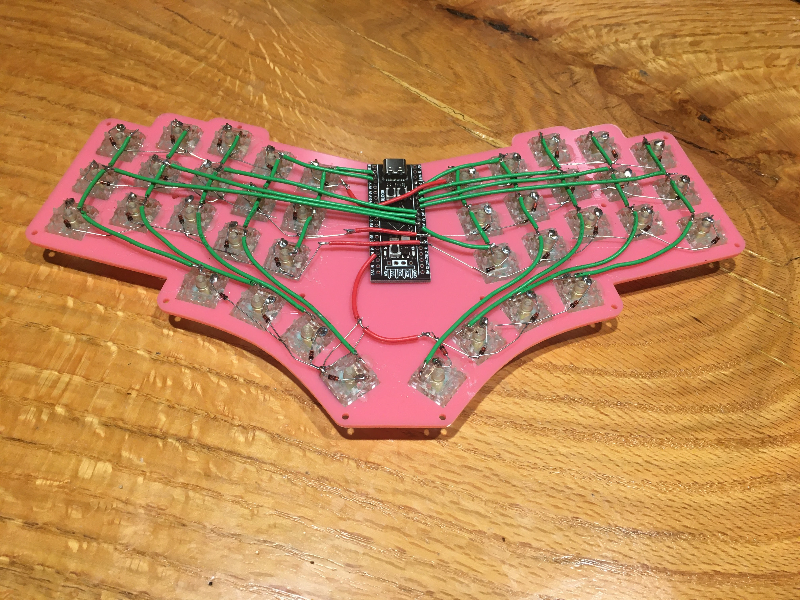
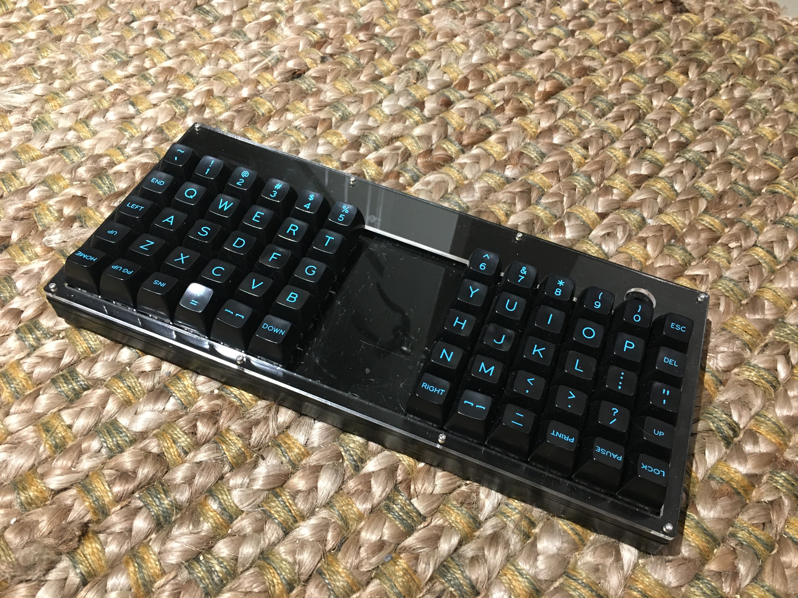
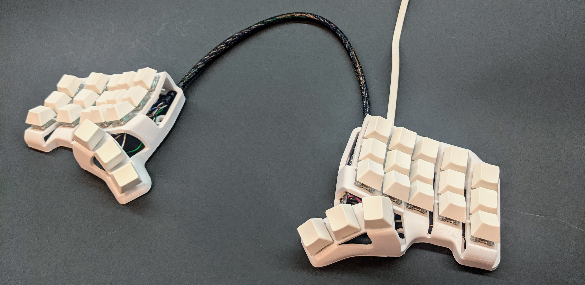

# cams-hand-wired-keebs
Firmware and other artifacts of building hand wired keyboards

## Pteron 38
[Design](https://github.com/FSund/pteron-keyboard) by FSund



## Lumberjack Remix
[Design](https://github.com/peej/lumberjack-keyboard) by peej


## Skeletyl
[Design](https://github.com/Bastardkb/Skeletyl) by Bastardkb



## Flashing
```
cargo objcopy --release -- -O binary binary.bin
dfu-util -a 0 -s 0x08000000:leave -D binary.bin --reset
```
